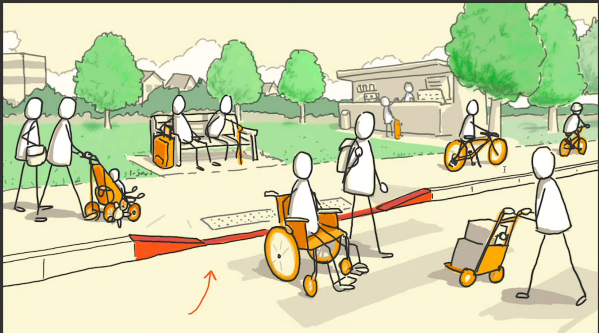

# Notes from the web accessability webinar

-   15% of population lives with some sort of permanent disability
    -   Disabilities are not always permanent
    -   Disabilities can also be Temporary or Situational
        -   Hearing could be situationally impaired when you are in a loud enviroment
        -   Touch could be temporarily impaired if you have a broken hand
        -   Blindness would be (usually) an example of a permanent disability
-   Making accessible digital services benefits everyone

    -   Elevators
    -   Automatic doors
    -   Curb cuts

      

    -   Everyone marked in orange benefits from the curb cut

## Web content accessibility guidelines

-   They are guidelines, not rules
-   Integrated into legislation in many countries
    -   Eg. Finland
    -   https://www.webaccessibility.fi
-   WCAG 2.1 is the latest version
-   Examples of criteria
    -   1.1.1 Non-text content
        -   All non-text content that is presented to the user has a text alternative that serves the equivalent purpose
    -   1.4.1 Use of color
        -   Color is not used as the only visual means of conveying information, indicating an action, prompting a response, or distinguishing a visual element
-   Accessability statements
    -   https://www.w3.org/WAI/planning/statements/
    -   https://www.w3.org/WAI/planning/statements/#examples

## Success criteria

https://www.webaccessibility.fi/requirements-of-the-act-on-the-provision-of-digital-services/wcag-2-1-legal-requirements/

-   There are pre-defined success criteria which have to be met in order to pass the test and be considered accessible
-   A -> AA -> AAA
    -   A is the minimum
    -   AA is the recommended
    -   AAA is the highest level
-   Perceivable
    -   Can users read the content?
-   Operable
    -   Can users use the content?
-   Understandable
    -   Can users understand the content?
-   Robust
    -   Can the content be used by a wide variety of user agents?
    -   Ie. Can the content be used by a screen reader or a braille display?

## Most common accessibility issues

-   96.8% of websites of a million sites have some sort of accessibility issues
-   Color contrast is the most common issue
    -   https://webaim.org/resources/contrastchecker/
    -   There are also other tools for checking color contrast accessibility
-   There are much more issues that can not be found by automatic tools but need human testing
    -   Eg. https://www.w3.org/WAI/test-evaluate/preliminary/

## Ideas from the panel discussion

-   Inclusion and diversity within an organization helps create more accessible products and services
-   https://gameaccessibilityguidelines.com/
